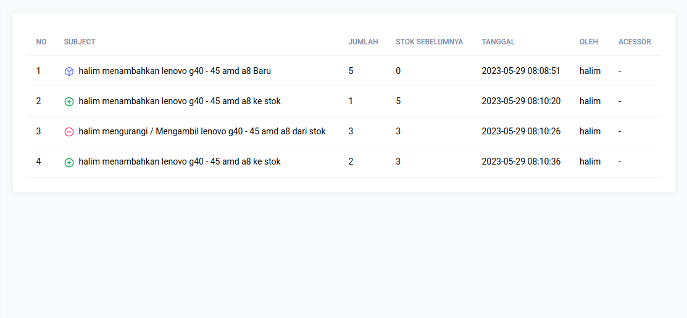
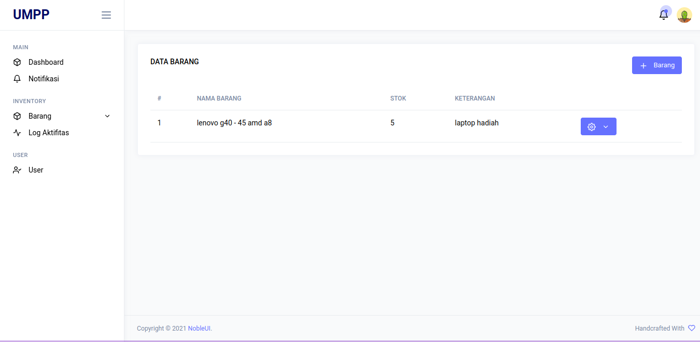

# Codeigniter Inventory app
Proyek latihan dalam membuat sistem inventory, proyek ini dibuat menggunakan PHP dan framework codeigniter, latihan yang dilakukan guna menambah dan mempertajam kemampuan dalam hal coding terutama pada bahasa pemrogaman PHP. Latihan ini juga dilakukan untuk mempelajari dan memahami framework codeigniter.

### Demo 
| | |
|:------:|:------:|
|  |  |

### Fitur
- [x] Login
- [x] Logout
- [x] Register
- [x] Dashboard
- [x] CRUD Barang
- [x] Log Aktivitas
- [x] CRUD User
- [ ] Notifikasi
- [ ] Laporan
- [ ] Export Laporan

